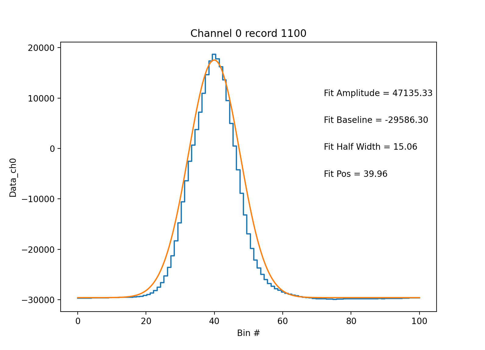

========================
Processing raw SP2 files
========================

The SP2 outputs .sp2b files that contain the waveforms in each channel for each
particle that is recorded. In addition, the SP2 also has .ini files that store
the probe configuration and .hk files that contain the SP2 housekeeping
information. In order to ultimately obtain processed SP2 data, all three of
these files are needed. For the first step where we process the raw SP2 waveforms,
we simply need the .sp2b files.

Processing a raw .sp2b file is as easy as:

.. code-block:: python

    waveforms = pysp2.io.read_sp2b(file_name)

Where file_name is the name of the file you want to read. The output is an
xarray Dataset containing the waveforms in each channel for each particle. The
"Data_chx" fields in the dataset contain these waveforms.

The next step is to generate the particle waveform statistics for processing. This includes
processing the peaks, half widths, and amplitudes of each wave. This information
is subsequently used to estimate particle sizes and masses. For this step, you will also
need the path to your dataset's .INI file for necessary probe configuration parameters.
In order to calculate the particle waveform statistics, do:

.. code-block:: python

    my_config = pysp2.io.read_config(path_to_ini_file)
    waves = pysp2.util.gaussian_fit(waveforms, my_config)

Finally, once these statistics are generated, you can view the waveforms with a simple
built-in visualization technique. In order to, for example, view the ch0 waveform for
the 1100th particle in the dataset, one can simply do:

.. code-block:: python

    pysp2.vis.plot_wave(my_sp2, 1100, 0)

You will get a plot like below. If you are making a plot from the scattering channels (usually 0, 4), the
Gaussian fit to the curve will also be plotted.

