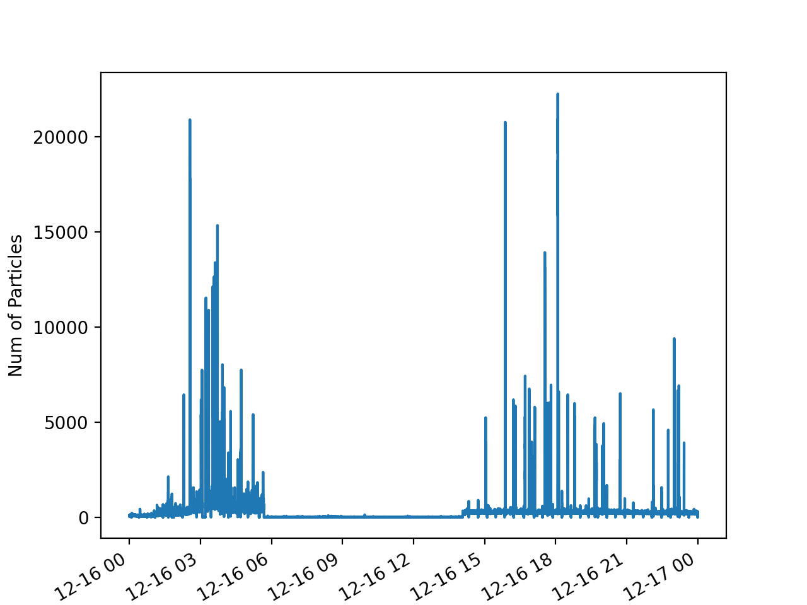

Viewing housekeeping data
=========================

PySP2 contains built-in modules for loading and viewing SP2 housekeeping files with
a .hk extension. These housekeeping files are then converted into xarray Datasets so that they
can be easily analyzed and plotted.
In order to load a housekeeping file, one simply does the following command:

.. code-block:: python

    my_hk = pysp2.io.read_hk_file(pysp2.testing.EXAMPLE_HK)

The :func:`pysp2.io.read_hk_file` function returns a standard xarray dataset. All of the variables
are 1 Hz timeseries. Therefore, each one of the variables in the xarray dataset can be visualized
using the standard xarray routines like this:

    my_hk['Num of Particles'].plot()
    plt.show()

